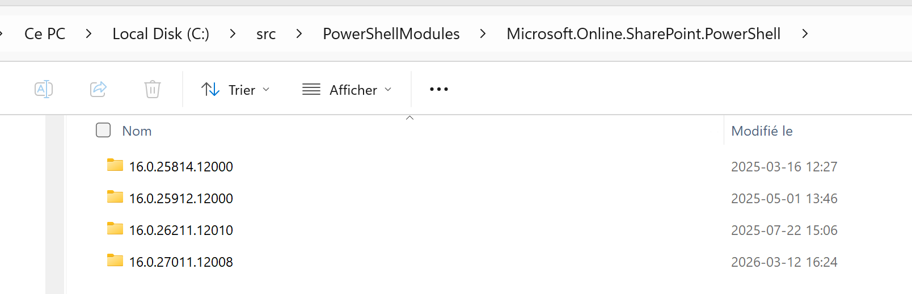

# Sharepoint management modules #
There are three main set of tools used in SharePoint management :
- **SharePoint Online Management Shell** : This is a PowerShell module provided by Microsoft to manage SharePoint Online. It allows administrators to perform various tasks such as creating and managing sites, users, and permissions. 
- **PnP PowerShell** : This is a community-driven PowerShell module that provides additional cmdlets for managing SharePoint Online. It offers a more user-friendly and efficient way to perform common tasks, such as provisioning sites, managing lists and libraries, and working with content types.
- **Graph API** : This is a RESTful API provided by Microsoft that allows developers to access and manage various Microsoft 365 services, including SharePoint Online. It provides a wide range of endpoints for managing sites, users, groups, and other resources in SharePoint Online.

Each of these tools are available through PowerShell modules.  Most of people typically install those modules on their local machines and use them to manage SharePoint Online. However, in my developper experience, it can quickly become cumbersome to manage multiple modules versions and keep them up to date. To address this issue, I never install the modules on my computer, but instead I save them in a dedicated folder in my project and import them from there. This way, I can easily manage the versions of the modules and ensure that I am using the correct version for each project. Additionally, it allows me to keep my local environment clean and avoid potential conflicts between different versions of the modules.


Over time, I built my own little recipe to manage the modules in my projects, which I will share with you in the next sections.

## Using the SharePoint Online Management Shell module ##
To use the SharePoint Online Management Shell module, you can follow these steps:
1. Download the module from the Microsoft website and save it to a folder in your project.
   ```powershell
    $pathToModules = "C:\src\PowerShellModules"
    Save-Module -Name Microsoft.Online.SharePoint.PowerShell -Path $pathToModules
   ```
2. When you want to use the module in your PowerShell script, you can import it from the folder where you saved it.
   ```powershell
    $versionUsed = "16.0.27011.12008"
    Import-Module "$pathToModules\Microsoft.Online.SharePoint.PowerShell\$versionUsed\Microsoft.Online.SharePoint.PowerShell.psd1" -UseWindowsPowerShell
   ```
## Using the PnP PowerShell module ##
To use the PnP PowerShell module, you can follow these steps:
1. Download the module from the PowerShell Gallery and save it to a folder in your project.
   ```powershell
    $pathToModules = "C:\src\PowerShellModules"
    Save-Module -Name PnP.PowerShell -Path $pathToModules
   ```
2. When you want to use the module in your PowerShell script, you can import it from the folder where you saved it.
   ```powershell
    $versionUsed = "3.1.0"
    $pathToPnPModule = "$pathToModules\PnP.PowerShell\$versionUsed\PnP.PowerShell.psd1"
    Import-Module $pathToPnPModule
   ```

